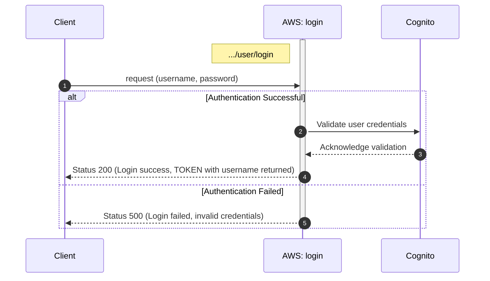

## Login

Returns the jsonwebtoken with user name if authentication is succesful.

```
user/
└── login.js 
```

<!-- ### Sequence diagram-->



### Definition for serverless.yml

`functions:`
```
  loginUser:
    handler: user/login.handler
    events:
      - httpApi:
          path: /user/login
          method: post
```

### Endpoint
sls deploy returns endpoint for login

| Endpoint Url            | HTTP Method |
|-------------------------|-------------|
| https://vr6mgijfvf.execute-api.eu-north-1.amazonaws.com/user/login     | POST         |


**Request**

| Name         | Type                                   | Description                                                |
|--------------|----------------------------------------|------------------------------------------------------------|
| username   | string                                 |  email|
| password         | string | password given when registered


**Response**

| Name            | Type           | Description                                           |
|-----------------|----------------|-------------------------------------------------------|
| token         | jsonwebtoken          | is needed for requests to AWS |
| firstname lastname         | string          | complete name of user |

If not valid authetication, message "Invalid username or password" is returned.


### Testing

```
requests/
└── user/
    └── post_login.rest
```

```
POST https://vr6mgijfvf.execute-api.eu-north-1.amazonaws.com/user/login
Content-Type: application/json

{
  "email": "AA4598@student.jamk.fi",
  "password": "topsecret"
}
```
**On success**


**On failure**
