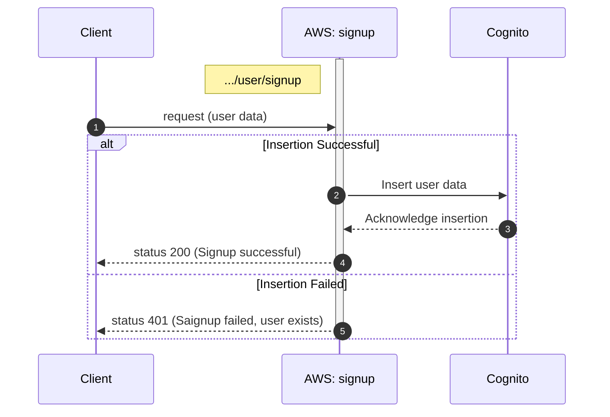

## Signup


```
user/
└── signup.js 
```

<!-- ### Sequence diagram-->



1. client requests for signup
2. user data (name, email and password) is inserted into Cognito if email not already exists 
3. information of the successful is returned
4. if insertion is successful status code 200 is returned to the client
5. if insertion fails status code 500 is returned to the client


### Definition for serverless.yml

`functions:`
```  
  signupUser:
    handler: user/signup.handler
    events:
      - httpApi:
          path: /user/signup
          method: post  
```

### Endpoint
| Endpoint Url            | HTTP Method |
|-------------------------|-------------|
| https://vr6mgijfvf.execute-api.eu-north-1.amazonaws.com/user/signup     | POST         |


**Request**

| Name         | Type                                   | Description                                                |
|--------------|----------------------------------------|------------------------------------------------------------|
| email         | string          | email of user |
| password         | string          | given secret password |
| name         | string          | name of user |


**Response**

| Name            | Type           | Description                                           |
|-----------------|----------------|-------------------------------------------------------|
| statuscode         | number          | 200 on success, 500 on failure|


### Testing

```
requests/
└── user/
    └── post_signup.rest
```

```
POST https://vr6mgijfvf.execute-api.eu-north-1.amazonaws.com/user/signup
Content-Type: application/json

{
  "email": "AA4598@student.jamk.fi",
  "password": "topsecret",
  "name": "Timo Laakkonen"  
}
```
**On success**


```Amazon Cognito > User pools > serverless-auth-pool > Users```


**On failure**
