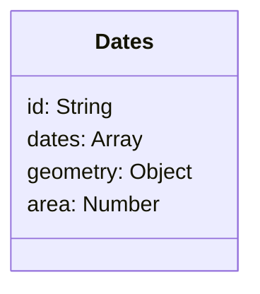

#### datesSchema


**dates.js**
```
mongo/
└── models/
    └── dates.js
```

```javascript
var mongoose = require("mongoose");
const uniqueValidator = require("mongoose-unique-validator");

var datesSchema = new mongoose.Schema({
  id: {
    type:String,
    required: true,
    unique: true
  },
  dates: Array,
  geometry: {
    type: Object,
    unique: true
  },
  area: Number
});

datesSchema.plugin(uniqueValidator);
module.exports = new mongoose.model("Dates", datesSchema);
```