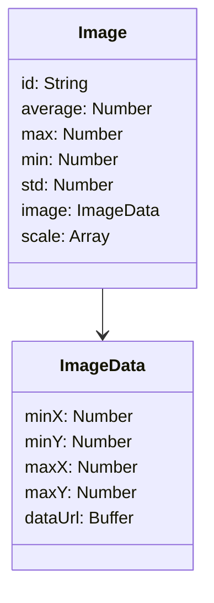

#### imageSchema


**image.js**
```
mongo/
└── models/
    └── image.js
```

```
var mongoose = require("mongoose");
const uniqueValidator = require("mongoose-unique-validator");

var imageSchema = new mongoose.Schema({
  id: {
    type:String,
    required: true,
    unique: true
  },
  average: Number,
  max: Number,
  min: Number,
  std: Number,
  image: {
    minX: Number,
    minY: Number,
    maxX: Number,
    maxY: Number,
    dataUrl: Buffer
  },
  scale: Array
});

imageSchema.plugin(uniqueValidator);
module.exports = new mongoose.model("Image", imageSchema);
```