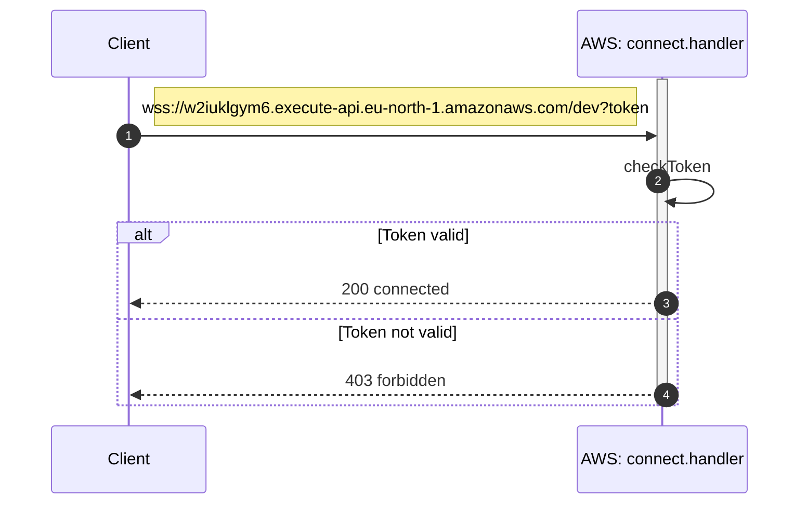
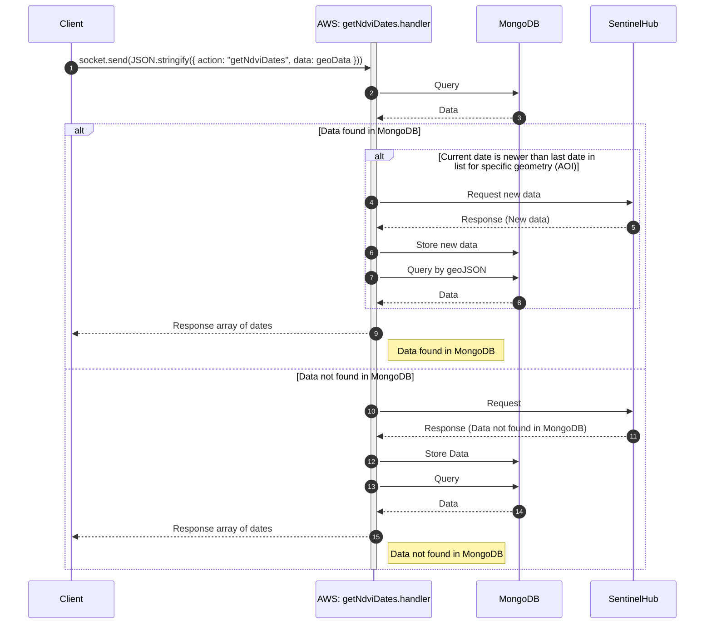
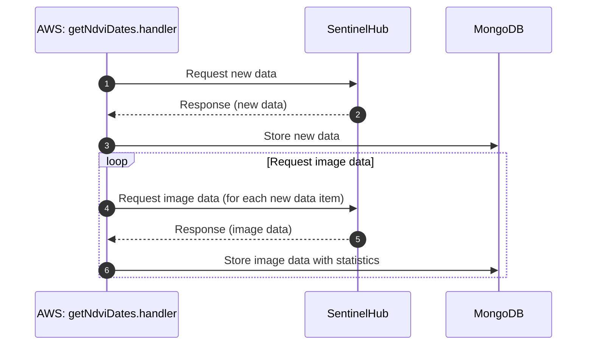
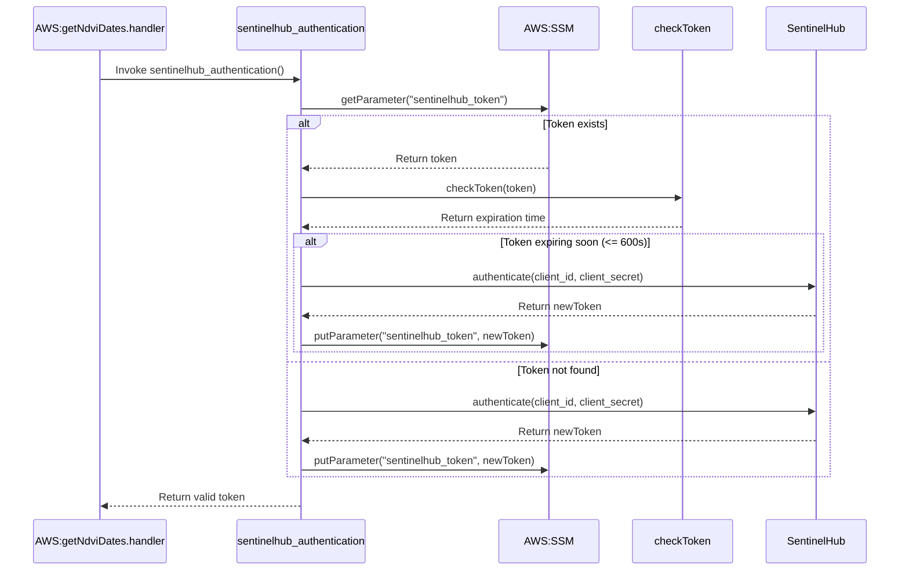

#### Dates

The connection method is WebSocket. The WebSocket connection is secured using a token during the connection process. 
While getting data the situation/phases of the process is sent by websocket.

Retrieves/returns a list of Sentinel-hub NDVI dates with statistics and updates the database if new data is available.

List the days with found images for the given geometry found in Sentinel Hub. Service should store the given geometry and the days in which the images can be found so that there would be no need to re-query the days (only newer days from the last query should be queried) every time from Sentinel Hub. If the image is available for given day then the service should assign unique id "sentinelid" for that day and image. 

################


## connect
During the connect function, a token is used to authenticate the WebSocket connection.



## getNdviDates



if new data (statistics) is available it will be stored into the database. Also NDVI-imagedata related to all new dates will be request from SentinelHub



## SentinelHub token-based authentication

For use of sentinelHub-service needs autentication token

sentinekhub token pitää ottaa talteen sillä sitä ei voida kysellä joka requestin yhteydessä not allowed for...
TÄMÄ LIITTYY dates websocket kohtaan SIIRRÄÄ sinne!!! koska siellä vain ollaan yhteydessä sentinelhubiin!!!!


Tämä kokonaisuudessaan tekee muutakin kuin vain palauttaa tiedot, hakeee sentinelistä ja tallentaa tietokantaan niin ei tarvitse jatkossa enää hakea ja käyttää sentnelhubin process ja request units.


## Code locations
```
websocket/
├── connect.js
├── disconnect.js 
└── getNdviDates.js
```


## Definition for serverless.yml

`functions:`
```
  connect:
    handler: websocket/connect.handler
    events:
      - websocket:
          route: $connect
  disconnect:
    handler: websocket/disconnect.handler
    events:
      - websocket:
          route: $disconnect
  getNdviDates:
    handler: websocket/getNdviDates.handler
    timeout: 240
    events:
      - websocket:
          route: getNdviDates
```
timeout is most important, depending of the size of the aoi (area of interenst) geometry, depending on timerange and traffic enough time is needed for the process.


##################################### tämä lähetetään fronendistä ja funktio on getNdvi...

on client

const geoData = {
    start_date: startDate,
    end_date: endDate,
    geometry: geoJson,
  };
socket.send(JSON.stringify({ action: "getNdviDates", data: geoData }));
#####################################

| Endpoint Url      |
| ----------------- |
| wss://w2iuklgym6.execute-api.eu-north-1.amazonaws.com/dev |


## **Request**

| Name         | Type                                   | Description                                                |
|--------------|----------------------------------------|-------------------------------------------------------------|
| geometry     | geoJSON                                | Geometry in geoJSON format, coordinate reference system WGS84 (EPSG:4326) |
| start_date   | dateString (ISO 8601) | The start date to include images from                      |
| end_date     | dateString (ISO 8601) | The end date to include images to                          |

```
{   
	"geometry": "geoJSON",
	"start_date": "dateString",
	"end_date": "dateString"
}
```

## **Response**

| Name           | Type                                   | Description                                           |
|----------------|----------------------------------------|-------------------------------------------------------|
|                | array                                  | All the days from which images can be queried          |
| generationtime | dateString (ISO 8601) | The date of the image                                 |
| sentinelid     | string                 | generationtime and geometry converted to sha256-format, generated for the request to be used when fetching the image from database e.g. 2023-05-30T00:00:00Z_c7a5478757abfae7286751b0950e58991fa3f6ef77f77e844baba038cb86b647|

```json 
[
  {
    "generationtime": "2023-05-15T00:00:00Z",
    "sentinelid": "2023-05-15T00:00:00Z_c7a5478757abfae7286751b0950e58991fa3f6ef77f77e844baba..."
  },
  {
    "generationtime": "2023-05-30T00:00:00Z",
    "sentinelid": "2023-05-30T00:00:00Z_c7a5478757abfae7286751b0950e58991fa3f6ef77f77e844baba..."
  },
  ...
]
```


