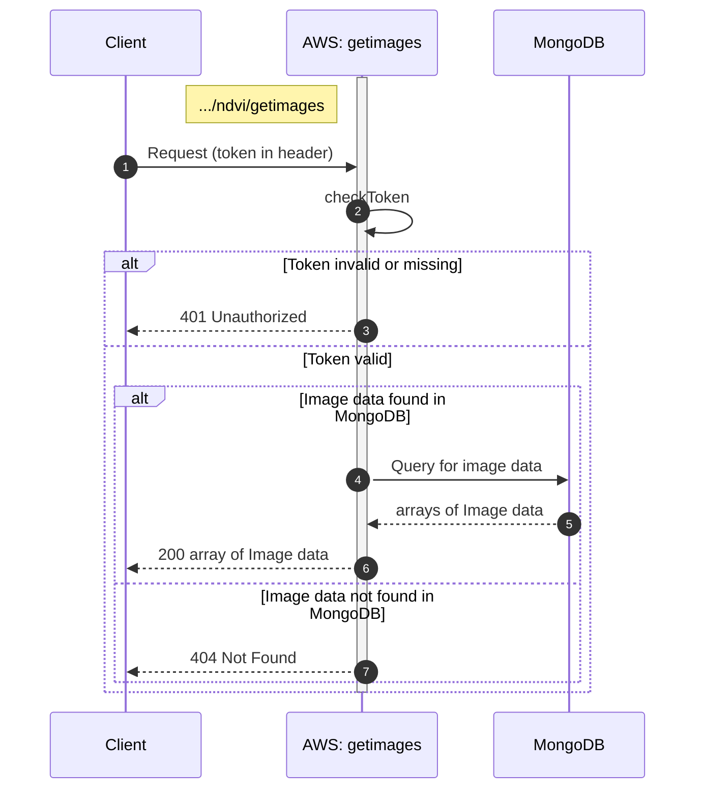

#### Images

The route needs valid token by cognito login.
Returns all the NDVI images with statictics for the given sentinelid.



```
NDVI/
└── lambda/
    └── getimages.js
```

#### Definition for serverless.yml
`functions:`
```
get_allimages:
    handler: NDVI/lambda/getimages.handler
    events:
      - httpApi:
          path: /ndvi/getimages
          method: post
          authorizer: PrivateAuthorizer
```


| Endpoint Url            | HTTP Method |
|-------------------------|-------------|
| https://vr6mgijfvf.execute-api.eu-north-1.amazonaws.com/ndvi/getimages     | POST         |


**Request**

| Name         | Type                                   | Description                                                |
|--------------|----------------------------------------|------------------------------------------------------------|
| sentinelid   | string                                 |  id for image (generated when image with related data fetched from sentinelhub and saved into database) |
| epsg         | integer |  optional, used when related coordinates need to be in system EPSG:3067


**Response array of items**

| Name            | Type           | Description                                           |
|-----------------|----------------|-------------------------------------------------------|
| average         | float          | Average value of the NDVI                             |
| max             | float          | Maximum value of the NDVI                             |
| min             | float          | Minimum value of the NDVI
| std             | float          | Standard deviation value of the NDVI                             |
| image           |                | Image of the NDVI                                     |
| image.minX      | float          | Bounding rect minimum X value, coordinate reference system WGS84 (EPSG:4326) |
| image.minY      | float          | Bounding rect minimum Y value, coordinate reference system WGS84 (EPSG:4326) |
| image.maxX      | float          | Bounding rect maximum X value, coordinate reference system WGS84 (EPSG:4326) |
| image.maxY      | float          | Bounding rect maximum Y value, coordinate reference system WGS84 (EPSG:4326) |
| image.dataUrl   | Base&4 string  | Image in Base64 string format (i.e., data:image/png;base64...)   |
| scale           | array          | Array for NDVI value categories as colours            |
| scale.color     | string         | Colour as RGB string value                            |
| scale.amount    | integer        |                                                       |
| scale.from      | float          |                                                       |


**Response datatypes**

```json
{
  "average": "float",
  "max": "float",
  "min": "float",
  "std": "float",
	"image": {
		"minX": "float",
		"minY": "float",
		"maxX": "float",
		"maxY": "float",
		"dataUrl": "Base64 string"
	},
	"scale": [
		{
			"color": "string",
			"amount": "integer",
			"from": "float"
		},
		{
			"color": "string",
			"amount": "integer",
			"from": "float"
		},
		{
			"color": "string",
			"amount": "integer",
			"from": "float"
		},
		{
			"color": "string",
			"amount": "integer",
			"from": "float"
		}
	]
}
```

**Example**

```json
{
  "average": 0.5657129907618343,
  "max": 0.75,
  "min": 0.15,
  "std": 0.90 
	"image": {
		"minX": 26.1930913,
		"minY": 62.9857763,
		"maxX": 26.194766,
		"maxY": 62.9867615
		"dataUrl": "data:image/png;base64,iVBORw0KGgoAAAANSUhEUgAAAFoAAABuCAYAAACnQwS5AAADnEl..."
	},
	"scale": [
		{
			"color": "rgb(244, 67, 54)",
			"amount": 0,
			"from": 0.15
		},
		{
			"color": "rgb(255, 152, 0)",
			"amount": 0,
			"from": 0.3
		},
		{
			"color": "rgb(255, 235, 59)",
			"amount": 22,
			"from": 0.45
		},
		{
			"color": "rgb(76, 175, 80)",
			"amount": 78,
			"from": 0.6
		}
	]
}
```


