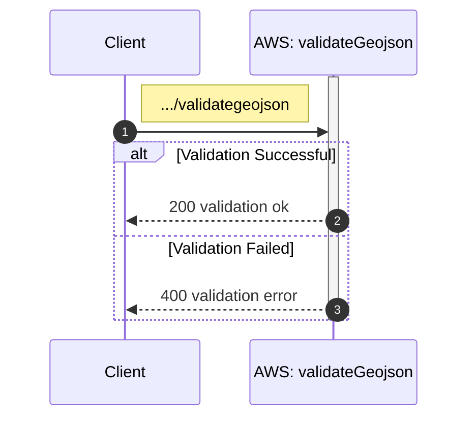

## validateGeoJson

Returns knowledge if given geoJson is valid or not.

```
NDVI/
└── lambda/
    └── validateGeojson.js
```

<!-- ### Sequence diagram-->



### Definition for serverless.yml

`functions:`
```
  validateGeojson:
    handler: NDVI/lambda/validateGeojson.handler
    events:
      - httpApi:
          path: /validategeojson
          method: post

```

### Endpoint
sls deploy returns endpoint for login

| Endpoint Url            | HTTP Method |
|-------------------------|-------------|
| https://vr6mgijfvf.execute-api.eu-north-1.amazonaws.com/validategeojson     | POST         |


**Request**

| Name         | Type                                   | Description                                                |
|--------------|----------------------------------------|------------------------------------------------------------|
| geojson   | geoJSON                                 |  Geometry of Area of Interest in geoJSON format|


**Response**

| Statuscode            | Type           | Description                                           |
|-----------------|----------------|-------------------------------------------------------|
| 200         | number         | validation ok|
| 400         | number         | validation failed|

If not valid authetication, message "Invalid username or password" is returned.


### Testing

```
requests/
└── ndvi/
    └── get_geojson_validation.rest
```

```
POST https://vr6mgijfvf.execute-api.eu-north-1.amazonaws.com/validategeojson
Content-Type: application/json

{
  "geojson": {
    "type": "Polygon",
    "coordinates": [
      [
        [24.019017492777, 64.233073829478],
        [24.019347556527, 64.232990313561],
        [24.019615315522, 64.232919904435],
        [24.020482755912, 64.233076168492],
        [24.022361546928, 64.233414777739],
        [24.022304933188, 64.233512300717],
        [24.022162986048, 64.233683337832],
        [24.020810232778, 64.233413298021],
        [24.020072476793, 64.23327072941],
        [24.019017492777, 64.233073829478]
      ]
    ]
  }
}
```
**On success**


**On failure**
