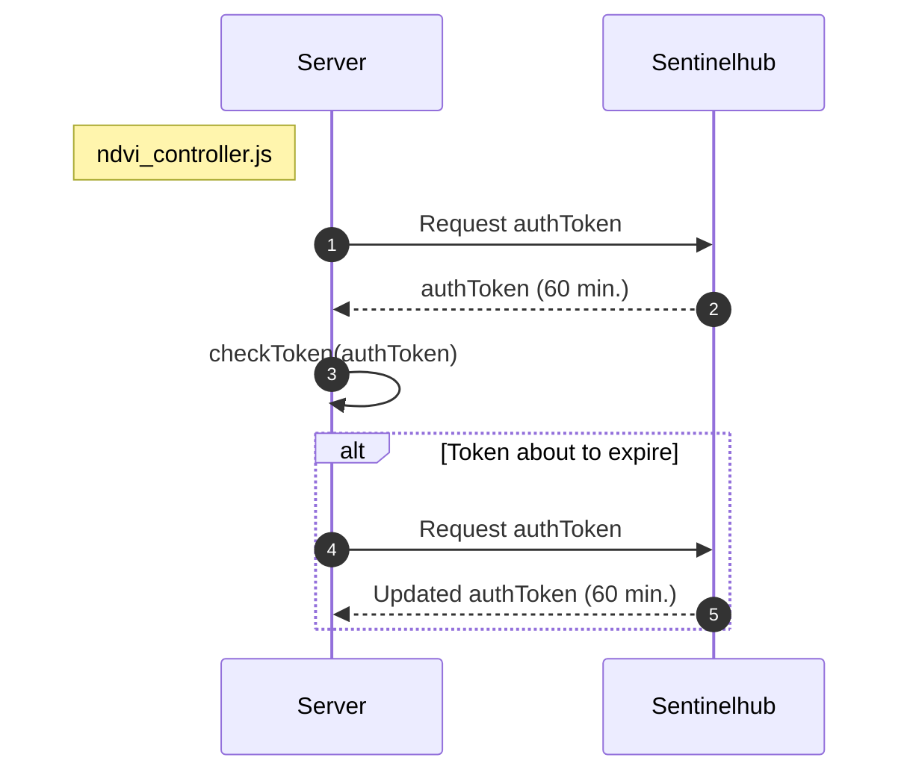

<br>
The Authentication to sentinel-hub services needs the personal account variables stored into .env file
e.g.
```
sentinelHubClientId = "6c9c641b-cc70-4595-8007-360b09cd533a"
sentinelHubClientSecret = "88myeh2ksnUjQjcCMTL580HAkoifxYgR"
instanceId = "8c9fd4ff-f38d-42ef-aad2-0f0a2d0d7bfa"
```

In production version environment variables should be stored in secrets of the server.


**Sequence diagram**



When request for token from sentinelhub it will be expired in 60 min, so it need to be asked for new one, so expiration need to be checked for a while on serverside code.


**request for token**

```../utils/authenticate.js```

**request for the time left for the expiration**

```../utils/checkToken.js```

**var authToken** 

Is holding the token to sentinelHub. 
It is a global variable, the scope in the code of ndvi_cotroller.js

**middleware can be used for authetication process just for specifig route**

ndvi-routes.js
```
const middleware = require('../middlewares/sentinelhub_token')
router.post('/list', middleware.checkToken,ndviControllers.list);
```
