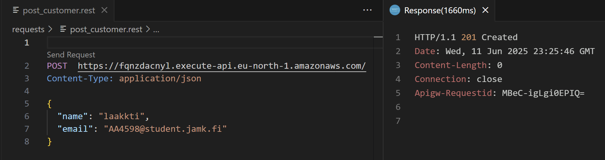
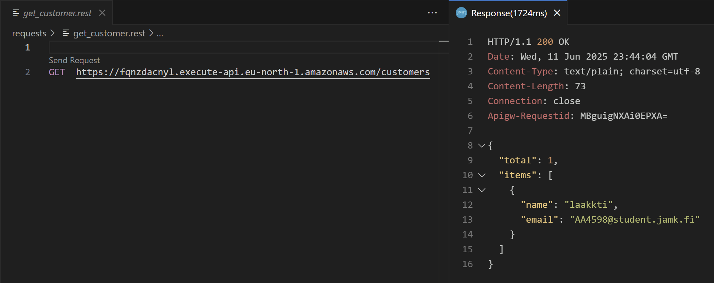

## endpoints

```
endpoints:
  GET - https://fqnzdacnyl.execute-api.eu-north-1.amazonaws.com/
  POST - https://fqnzdacnyl.execute-api.eu-north-1.amazonaws.com/
  GET - https://fqnzdacnyl.execute-api.eu-north-1.amazonaws.com/customers

functions:
  hello: aws-1-dev-hello (18 MB)
  createCustomer: aws-1-dev-createCustomer (18 MB)
  getCustomers: aws-1-dev-getCustomers (18 MB)
```

## create customer

```
/
└── createCustomer.js    
```

### serverless.yml
`functions:`
```
createCustomer:
    handler: createCustomer.createCustomer
    events:
      - httpApi:
          path: /
          method: post
```

### testing

```
requests/
└── post_customer.rest    
```

```
POST https://fqnzdacnyl.execute-api.eu-north-1.amazonaws.com/
Content-Type: application/json

{
  "name": "laakkti",
  "email": "AA4598@student.jamk.fi"
}
```




## get customers

```
/
└── getCustomers.js    
```


### serverless.yml

`functions:`
```
getCustomers:
    handler: getCustomers.getCustomers
    events:
      - httpApi:
          path: /customers
          method: get
```


### testing

```
requests/
└── get_customer.rest    
```

```
GET https://fqnzdacnyl.execute-api.eu-north-1.amazonaws.com/customers
```
