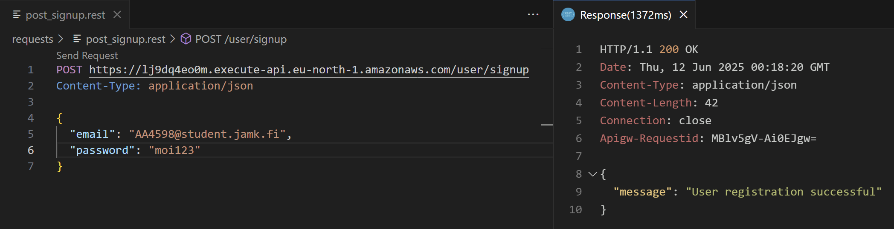
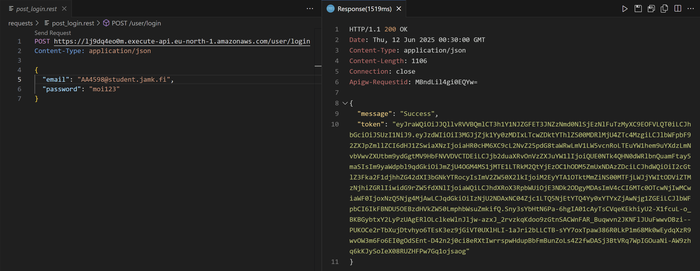
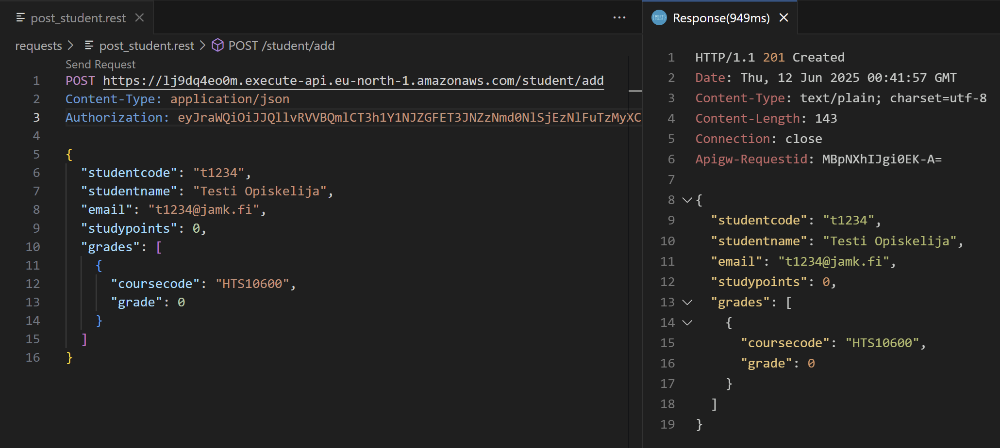
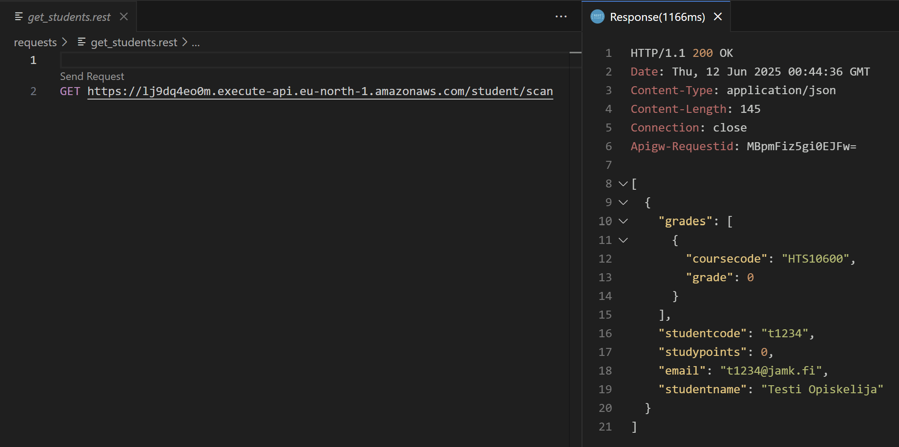

## endpoints

```
endpoints:
  POST - https://lj9dq4eo0m.execute-api.eu-north-1.amazonaws.com/user/signup
  POST - https://lj9dq4eo0m.execute-api.eu-north-1.amazonaws.com/user/login  
  POST - https://lj9dq4eo0m.execute-api.eu-north-1.amazonaws.com/user/private
  POST - https://lj9dq4eo0m.execute-api.eu-north-1.amazonaws.com/student/add
  GET - https://lj9dq4eo0m.execute-api.eu-north-1.amazonaws.com/student/scan

functions:
  signupUser: aws-teht2-cognito-auth-dev-signupUser (3.7 MB)
  loginUser: aws-teht2-cognito-auth-dev-loginUser (3.7 MB)  
  privateAPI: aws-teht2-cognito-auth-dev-privateAPI (3.7 MB)
  addStudent: aws-teht2-cognito-auth-dev-addStudent (3.7 MB)
  scanStudents: aws-teht2-cognito-auth-dev-scanStudents (3.7 MB)
```

## signup

### code
```
user/
  └── signup.js
```

### serverless.yml
`functions:`
```
signupUser:
    handler: user/signup.handler
    events:
      - httpApi:
          path: /user/signup
          method: post
```

### testing
```
requests/
└── post_signup.rest    
```

```
POST https://lj9dq4eo0m.execute-api.eu-north-1.amazonaws.com/user/signup
Content-Type: application/json

{
  "name": "laakkti",
  "email": "AA4598@student.jamk.fi"
}
```



## login

### code
```
user/
  └── login.js
```

### serverless.yml
`functions:`
```
loginUser:
    handler: user/login.handler
    events:
      - httpApi:
          path: /user/login
          method: post
```

### testing
```
requests/
└── post_login.rest    
```

```
POST https://lj9dq4eo0m.execute-api.eu-north-1.amazonaws.com/user/login
Content-Type: application/json

{
  "email": "AA4598@student.jamk.fi",
  "password": "moi123"
}
```




## add student

### code
```
student/
   └── addstudent.js
```

### serverless.yml
`functions:`
```
addStudent:
    handler: student/addstudent.handler
    events:
      - httpApi:
          path: /student/add
          method: post
          authorizer: PrivateAuthorizer
```

### testing
```
requests/
    └── post_student.rest    
```

```
POST https://lj9dq4eo0m.execute-api.eu-north-1.amazonaws.com/student/add
Content-Type: application/json
Authorization: eyJraWQiOiJJQllvRVVBQmlCT3h1Y1NJZGFET3JNZzNmd0NlSjEzNlFuTzMyXC9EOFVLQT0iLCJhbGciOiJSUzI1NiJ9.eyJzdWIiOiI3MGJjZjk1Yy0zMDIxLTcwZDktYThlZS00MDRlMjU4ZTc4MzgiLCJlbWFpbF92ZXJpZmllZCI6dHJ1ZSwiaXNzIjoiaHR0cHM6XC9cL2NvZ25pdG8taWRwLmV1LW5vcnRoLTEuYW1hem9uYXdzLmNvbVwvZXUtbm9ydGgtMV9HbFNVVDVCTDEiLCJjb2duaXRvOnVzZXJuYW1lIjoiQUE0NTk4QHN0dWRlbnQuamFtay5maSIsIm9yaWdpbl9qdGkiOiJiOGZjMTMzMS1jZTk5LTQ1YjUtOTE0Mi0yODQ4NDVlZDc2MjMiLCJhdWQiOiI2cGtlZ3Fka2F1djhhZG42dXI3bGNkYTRocyIsImV2ZW50X2lkIjoiY2M0NmUxNjQtNzgxZi00OWUwLTk1YzUtYjU3NmFhMjg1ZDYxIiwidG9rZW5fdXNlIjoiaWQiLCJhdXRoX3RpbWUiOjE3NDk2ODg4MjgsImV4cCI6MTc0OTcwNjgyOCwiaWF0IjoxNzQ5Njg4ODI4LCJqdGkiOiIxZmEwZmZmOS02Mjc5LTQ5MzctYTg3ZC1jMjU4ZGIzYTYwZjgiLCJlbWFpbCI6IkFBNDU5OEBzdHVkZW50LmphbWsuZmkifQ.kq2puijUNIHogKfwGfEwMbs9o5IJtBouv3S3RRRUjENaZufcB6WBXhGpZ-csyIEQpyoaSMxCjLCChkuvs-27QcwLO_KRO_gOHsIrrlOi92UW-Vub36dDjPXh9NLjGDNrL7CGyv5pdIWAxSk7EcnxL9h9NfuypLmwljIBKOzPVqq3UvG_U2u3ycMUYGWcQ4FXOBmjWcl2EkLzyBgZ8BCVHr4O__iHIVxIrCCahOiUU1VxheRsqxPYCo79sji1BA7twLfax3-D_UFnPIllUQSi2SFDnyH3etWQqPtW3eFjWkR6CalIKwlys46NJpegB9eZyDyLZvVbvKalf9NLTsjbKQ

{
  "studentcode": "t1234",
  "studentname": "Testi Opiskelija",
  "email": "t1234@jamk.fi",
  "studypoints": 0,
  "grades": [
    {
      "coursecode": "HTS10600",
      "grade": 0
    }
  ]
}
```




## get students

### code
```
student/
   └── scantudents.js
```

### serverless.yml
`functions:`
```
scanStudents:
    handler: student/scanstudents.handler
    events:
      - httpApi:
          path: /student/scan
          method: get
```

### testing
```
requests/
    └── get_students.rest    
```

```
GET https://lj9dq4eo0m.execute-api.eu-north-1.amazonaws.com/student/scan
```


