## endpoints

```
endpoints:
  POST - https://hwv3c16t2c.execute-api.eu-north-1.amazonaws.com/user/signup
  POST - https://hwv3c16t2c.execute-api.eu-north-1.amazonaws.com/user/login
  POST - https://hwv3c16t2c.execute-api.eu-north-1.amazonaws.com/graphql
  GET - https://hwv3c16t2c.execute-api.eu-north-1.amazonaws.com/graphql
  POST - https://hwv3c16t2c.execute-api.eu-north-1.amazonaws.com/user/private

functions:
  signupUser: aws-teht3-graphql-cognito-auth-dev-signupUser (8.3 MB)
  loginUser: aws-teht3-graphql-cognito-auth-dev-loginUser (8.3 MB)
  dographql: aws-teht3-graphql-cognito-auth-dev-dographql (8.3 MB)
  privateAPI: aws-teht3-graphql-cognito-auth-dev-privateAPI (8.3 MB)
```

## signup

### code
```
user/
  └── signup.js
```

### serverless.yml
`functions:`
```
signupUser:
    handler: user/signup.handler
    events:
      - httpApi:
          path: /user/signup
          method: post
```

### testing
```
requests/
└── post_signup.rest    
```

```
POST https://lj9dq4eo0m.execute-api.eu-north-1.amazonaws.com/user/signup
Content-Type: application/json

{
  "name": "laakkti",
  "email": "AA4598@student.jamk.fi"
}
```

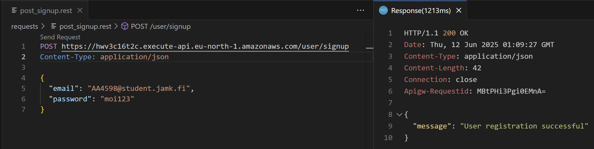

## login

### code
```
user/
  └── login.js
```

### serverless.yml

`functions:`
```
loginUser:
    handler: user/login.handler
    events:
      - httpApi:
          path: /user/login
          method: post
```

### testing
```
requests/
└── post_login.rest    
```

```
POST https://hwv3c16t2c.execute-api.eu-north-1.amazonaws.com/user/login
Content-Type: application/json

{
  "email": "AA4598@student.jamk.fi",
  "password": "moi123"
}
```

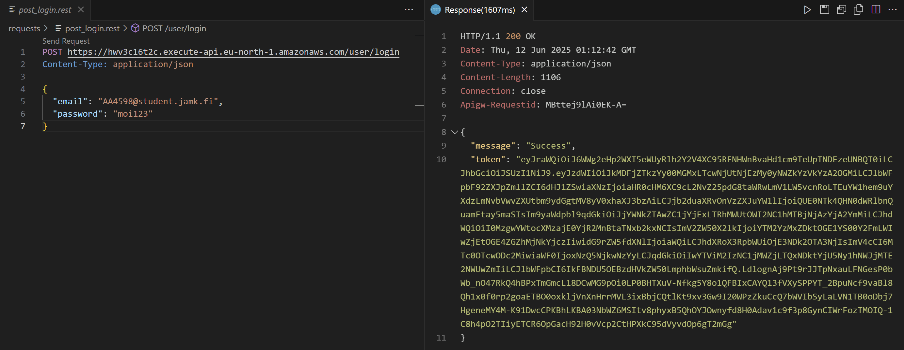


## Apolloserver

### code
```
apolloserver.js
```

### serverless.yml

`functions:`
```
dographql:
    handler: apolloserver.handler # serveritiedosto on ainoa lambda-funktio
    events:
      - httpApi:
          path: /graphql
          method: post # yleensä apollo server käyttää post-metodia
          authorizer: PrivateAuthorizer
      - httpApi:
          path: /graphql
          method: get # get-metodia voi käyttää hakukyselyihin, mutta ei mutaatioihin 
```

## add student

### code
```
student/
   └── addstudent.js
```

### testing
```
requests/
    └── post_student.rest    
```

```
POST https://hwv3c16t2c.execute-api.eu-north-1.amazonaws.com/graphql
Content-Type: application/json
Authorization: eyJraWQiOiJ6WWg2eHp2WXI5eWUyRlh2Y2V4XC95RFNHWnBvaHd1cm9TeUpTNDEzeUNBQT0iLCJhbGciOiJSUzI1NiJ9.eyJzdWIiOiJkMDFjZTkzYy00MGMxLTcwNjUtNjEzMy0yNWZkYzVkYzA2OGMiLCJlbWFpbF92ZXJpZmllZCI6dHJ1ZSwiaXNzIjoiaHR0cHM6XC9cL2NvZ25pdG8taWRwLmV1LW5vcnRoLTEuYW1hem9uYXdzLmNvbVwvZXUtbm9ydGgtMV8yV0xhaXJ3bzAiLCJjb2duaXRvOnVzZXJuYW1lIjoiQUE0NTk4QHN0dWRlbnQuamFtay5maSIsIm9yaWdpbl9qdGkiOiJhNjRhZjBhNi01MzQxLTQ1ZDgtODYyNi05NmMxOTM4MWI4NTQiLCJhdWQiOiI0MzgwYWtocXMzajE0YjR2MnBtaTNxb2kxNCIsImV2ZW50X2lkIjoiYmRmZTFjMDMtNDNjNC00OTIxLTkzMjItZmEyNDk4YTQyMjQzIiwidG9rZW5fdXNlIjoiaWQiLCJhdXRoX3RpbWUiOjE3NDk2OTExOTMsImV4cCI6MTc0OTcwOTE5MywiaWF0IjoxNzQ5NjkxMTkzLCJqdGkiOiI2NzQzZDNmOC00NzMyLTQ2ODgtYTBmNC1hMzBiMzU2NDM2ZjQiLCJlbWFpbCI6IkFBNDU5OEBzdHVkZW50LmphbWsuZmkifQ.OHt35TmB3WqG4rMCaimwZSKDQa_kfeXKFkXo7XzKRiyloeM7Xr38xk3fYvMwUdtNKhcSPjcqjJqrLlZfyuaGbyKNizohe21rmF8QjyAtOwZobDc08N3aum8sEcfz3WpY6b60iPRJ_jKb1oCIKccS2uR0KgNcj6qqnGJpJxOvpdyoDVGwoDR3kfhCkMh6i7J0v5NyGnz9M0azK2bvccWBB5P-k_FB-z3-MjE8ThH5tqzIksR6mp7NDeP2Q_FyEa2pHpAQXo-K4JSMVSicdyyE6XAQYrPfmjrl8Sd4CIT7_1I4vZB8NX_bZB5ukmfBiTrM4_QUSkKyKmLzNdINfMtGsg

{
  "query": "mutation addStudent($input: StudentInput!) { addStudent(input: $input) { studentcode studentname email studypoints grades { coursecode grade } } }",
  "variables": {
    "input": {
      "studentcode": "x666",
      "studentname": "laakktie",
      "email": "laakkti@example.com",
      "studypoints": 66,
      "grades": [
        {
          "coursecode": "CS101",
          "grade": 1
        }
      ]
    }
  }
}
```

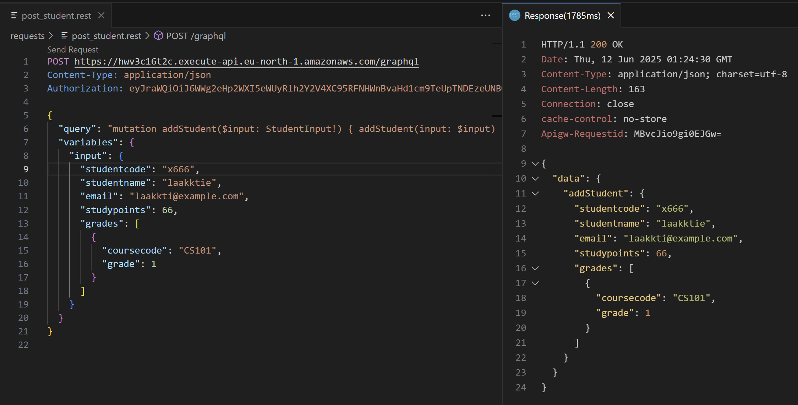


## get students

### code
```
student/
   └── getstudents.js
```

### testing
```
requests/
    └── get_students.rest    
```

```
POST https://hwv3c16t2c.execute-api.eu-north-1.amazonaws.com/graphql
Content-Type: application/json
Authorization: eyJraWQiOiJ6WWg2eHp2WXI5eWUyRlh2Y2V4XC95RFNHWnBvaHd1cm9TeUpTNDEzeUNBQT0iLCJhbGciOiJSUzI1NiJ9.eyJzdWIiOiJkMDFjZTkzYy00MGMxLTcwNjUtNjEzMy0yNWZkYzVkYzA2OGMiLCJlbWFpbF92ZXJpZmllZCI6dHJ1ZSwiaXNzIjoiaHR0cHM6XC9cL2NvZ25pdG8taWRwLmV1LW5vcnRoLTEuYW1hem9uYXdzLmNvbVwvZXUtbm9ydGgtMV8yV0xhaXJ3bzAiLCJjb2duaXRvOnVzZXJuYW1lIjoiQUE0NTk4QHN0dWRlbnQuamFtay5maSIsIm9yaWdpbl9qdGkiOiJhNjRhZjBhNi01MzQxLTQ1ZDgtODYyNi05NmMxOTM4MWI4NTQiLCJhdWQiOiI0MzgwYWtocXMzajE0YjR2MnBtaTNxb2kxNCIsImV2ZW50X2lkIjoiYmRmZTFjMDMtNDNjNC00OTIxLTkzMjItZmEyNDk4YTQyMjQzIiwidG9rZW5fdXNlIjoiaWQiLCJhdXRoX3RpbWUiOjE3NDk2OTExOTMsImV4cCI6MTc0OTcwOTE5MywiaWF0IjoxNzQ5NjkxMTkzLCJqdGkiOiI2NzQzZDNmOC00NzMyLTQ2ODgtYTBmNC1hMzBiMzU2NDM2ZjQiLCJlbWFpbCI6IkFBNDU5OEBzdHVkZW50LmphbWsuZmkifQ.OHt35TmB3WqG4rMCaimwZSKDQa_kfeXKFkXo7XzKRiyloeM7Xr38xk3fYvMwUdtNKhcSPjcqjJqrLlZfyuaGbyKNizohe21rmF8QjyAtOwZobDc08N3aum8sEcfz3WpY6b60iPRJ_jKb1oCIKccS2uR0KgNcj6qqnGJpJxOvpdyoDVGwoDR3kfhCkMh6i7J0v5NyGnz9M0azK2bvccWBB5P-k_FB-z3-MjE8ThH5tqzIksR6mp7NDeP2Q_FyEa2pHpAQXo-K4JSMVSicdyyE6XAQYrPfmjrl8Sd4CIT7_1I4vZB8NX_bZB5ukmfBiTrM4_QUSkKyKmLzNdINfMtGsg

{
  "query": "query { getStudents { studentcode studentname email studypoints grades { coursecode grade } } }"
}
```

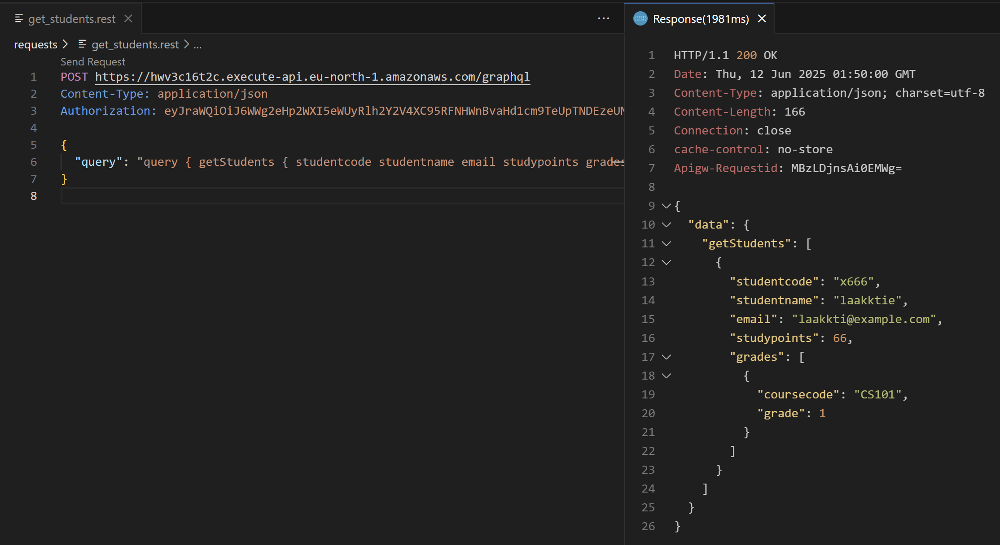

## get individual student

### code
```
student/
   └── getstudent.js
```

### testing
```
requests/
    └── get_student.rest    
```

```
POST https://hwv3c16t2c.execute-api.eu-north-1.amazonaws.com/graphql
Content-Type: application/json
Authorization: eyJraWQiOiJ6WWg2eHp2WXI5eWUyRlh2Y2V4XC95RFNHWnBvaHd1cm9TeUpTNDEzeUNBQT0iLCJhbGciOiJSUzI1NiJ9.eyJzdWIiOiJkMDFjZTkzYy00MGMxLTcwNjUtNjEzMy0yNWZkYzVkYzA2OGMiLCJlbWFpbF92ZXJpZmllZCI6dHJ1ZSwiaXNzIjoiaHR0cHM6XC9cL2NvZ25pdG8taWRwLmV1LW5vcnRoLTEuYW1hem9uYXdzLmNvbVwvZXUtbm9ydGgtMV8yV0xhaXJ3bzAiLCJjb2duaXRvOnVzZXJuYW1lIjoiQUE0NTk4QHN0dWRlbnQuamFtay5maSIsIm9yaWdpbl9qdGkiOiJhNjRhZjBhNi01MzQxLTQ1ZDgtODYyNi05NmMxOTM4MWI4NTQiLCJhdWQiOiI0MzgwYWtocXMzajE0YjR2MnBtaTNxb2kxNCIsImV2ZW50X2lkIjoiYmRmZTFjMDMtNDNjNC00OTIxLTkzMjItZmEyNDk4YTQyMjQzIiwidG9rZW5fdXNlIjoiaWQiLCJhdXRoX3RpbWUiOjE3NDk2OTExOTMsImV4cCI6MTc0OTcwOTE5MywiaWF0IjoxNzQ5NjkxMTkzLCJqdGkiOiI2NzQzZDNmOC00NzMyLTQ2ODgtYTBmNC1hMzBiMzU2NDM2ZjQiLCJlbWFpbCI6IkFBNDU5OEBzdHVkZW50LmphbWsuZmkifQ.OHt35TmB3WqG4rMCaimwZSKDQa_kfeXKFkXo7XzKRiyloeM7Xr38xk3fYvMwUdtNKhcSPjcqjJqrLlZfyuaGbyKNizohe21rmF8QjyAtOwZobDc08N3aum8sEcfz3WpY6b60iPRJ_jKb1oCIKccS2uR0KgNcj6qqnGJpJxOvpdyoDVGwoDR3kfhCkMh6i7J0v5NyGnz9M0azK2bvccWBB5P-k_FB-z3-MjE8ThH5tqzIksR6mp7NDeP2Q_FyEa2pHpAQXo-K4JSMVSicdyyE6XAQYrPfmjrl8Sd4CIT7_1I4vZB8NX_bZB5ukmfBiTrM4_QUSkKyKmLzNdINfMtGsg

{
  "query": "query GetStudent($input: StudentCodeInput!) { getStudent(input: $input) { studentcode, studentname, email, studypoints, grades { coursecode, grade } } }",  
  "variables": { "input": { "studentcode": "x666" } }
}

```

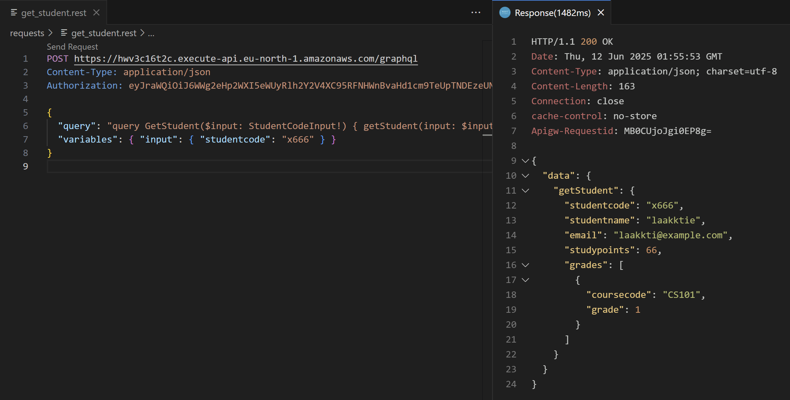


## update student

### code

```
student/
   └── updatestudent.js
```

### testing
```
requests/
    └── post_update.rest    
```

```
POST https://hwv3c16t2c.execute-api.eu-north-1.amazonaws.com/graphql
Content-Type: application/json
Authorization: eyJraWQiOiJ6WWg2eHp2WXI5eWUyRlh2Y2V4XC95RFNHWnBvaHd1cm9TeUpTNDEzeUNBQT0iLCJhbGciOiJSUzI1NiJ9.eyJzdWIiOiJkMDFjZTkzYy00MGMxLTcwNjUtNjEzMy0yNWZkYzVkYzA2OGMiLCJlbWFpbF92ZXJpZmllZCI6dHJ1ZSwiaXNzIjoiaHR0cHM6XC9cL2NvZ25pdG8taWRwLmV1LW5vcnRoLTEuYW1hem9uYXdzLmNvbVwvZXUtbm9ydGgtMV8yV0xhaXJ3bzAiLCJjb2duaXRvOnVzZXJuYW1lIjoiQUE0NTk4QHN0dWRlbnQuamFtay5maSIsIm9yaWdpbl9qdGkiOiJhNjRhZjBhNi01MzQxLTQ1ZDgtODYyNi05NmMxOTM4MWI4NTQiLCJhdWQiOiI0MzgwYWtocXMzajE0YjR2MnBtaTNxb2kxNCIsImV2ZW50X2lkIjoiYmRmZTFjMDMtNDNjNC00OTIxLTkzMjItZmEyNDk4YTQyMjQzIiwidG9rZW5fdXNlIjoiaWQiLCJhdXRoX3RpbWUiOjE3NDk2OTExOTMsImV4cCI6MTc0OTcwOTE5MywiaWF0IjoxNzQ5NjkxMTkzLCJqdGkiOiI2NzQzZDNmOC00NzMyLTQ2ODgtYTBmNC1hMzBiMzU2NDM2ZjQiLCJlbWFpbCI6IkFBNDU5OEBzdHVkZW50LmphbWsuZmkifQ.OHt35TmB3WqG4rMCaimwZSKDQa_kfeXKFkXo7XzKRiyloeM7Xr38xk3fYvMwUdtNKhcSPjcqjJqrLlZfyuaGbyKNizohe21rmF8QjyAtOwZobDc08N3aum8sEcfz3WpY6b60iPRJ_jKb1oCIKccS2uR0KgNcj6qqnGJpJxOvpdyoDVGwoDR3kfhCkMh6i7J0v5NyGnz9M0azK2bvccWBB5P-k_FB-z3-MjE8ThH5tqzIksR6mp7NDeP2Q_FyEa2pHpAQXo-K4JSMVSicdyyE6XAQYrPfmjrl8Sd4CIT7_1I4vZB8NX_bZB5ukmfBiTrM4_QUSkKyKmLzNdINfMtGsg

{
  "query": "mutation updateStudent($input: StudentInput!) { updateStudent(input: $input) { studentcode studentname email studypoints grades { coursecode grade } } }",
  "variables": {
    "input": {
      "studentcode": "x666",
      "studentname": "AA4598",
      "email": "AA4598@student.jamk.fi",     
      "studypoints": 66,
      "grades": [
        {
          "coursecode": "CS101",
          "grade": 1
        }
      ]
    }
  }
}
```
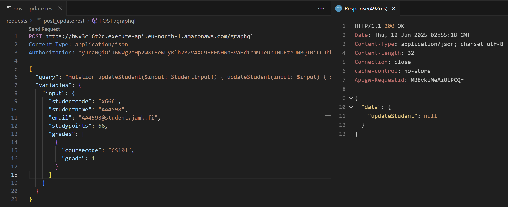

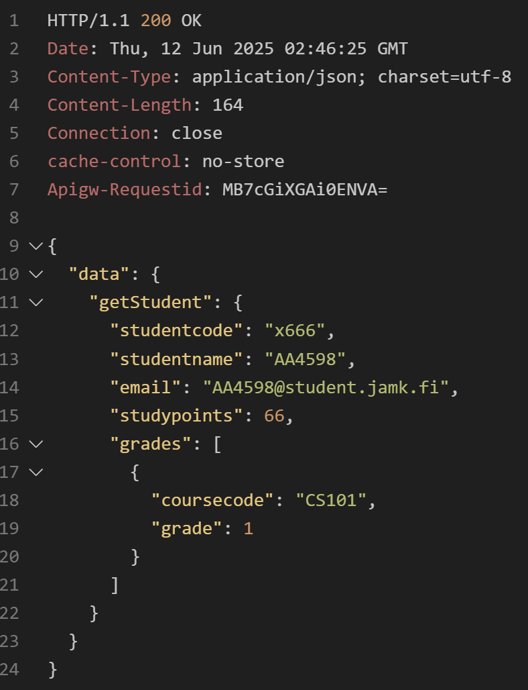


## delete student

### code
```
student/
   └── deletestudent.js
```

### testing
```
requests/
    └── post_delete.rest    
```

```
POST https://hwv3c16t2c.execute-api.eu-north-1.amazonaws.com/graphql
Content-Type: application/json
Authorization: eyJraWQiOiJ6WWg2eHp2WXI5eWUyRlh2Y2V4XC95RFNHWnBvaHd1cm9TeUpTNDEzeUNBQT0iLCJhbGciOiJSUzI1NiJ9.eyJzdWIiOiJkMDFjZTkzYy00MGMxLTcwNjUtNjEzMy0yNWZkYzVkYzA2OGMiLCJlbWFpbF92ZXJpZmllZCI6dHJ1ZSwiaXNzIjoiaHR0cHM6XC9cL2NvZ25pdG8taWRwLmV1LW5vcnRoLTEuYW1hem9uYXdzLmNvbVwvZXUtbm9ydGgtMV8yV0xhaXJ3bzAiLCJjb2duaXRvOnVzZXJuYW1lIjoiQUE0NTk4QHN0dWRlbnQuamFtay5maSIsIm9yaWdpbl9qdGkiOiJhNjRhZjBhNi01MzQxLTQ1ZDgtODYyNi05NmMxOTM4MWI4NTQiLCJhdWQiOiI0MzgwYWtocXMzajE0YjR2MnBtaTNxb2kxNCIsImV2ZW50X2lkIjoiYmRmZTFjMDMtNDNjNC00OTIxLTkzMjItZmEyNDk4YTQyMjQzIiwidG9rZW5fdXNlIjoiaWQiLCJhdXRoX3RpbWUiOjE3NDk2OTExOTMsImV4cCI6MTc0OTcwOTE5MywiaWF0IjoxNzQ5NjkxMTkzLCJqdGkiOiI2NzQzZDNmOC00NzMyLTQ2ODgtYTBmNC1hMzBiMzU2NDM2ZjQiLCJlbWFpbCI6IkFBNDU5OEBzdHVkZW50LmphbWsuZmkifQ.OHt35TmB3WqG4rMCaimwZSKDQa_kfeXKFkXo7XzKRiyloeM7Xr38xk3fYvMwUdtNKhcSPjcqjJqrLlZfyuaGbyKNizohe21rmF8QjyAtOwZobDc08N3aum8sEcfz3WpY6b60iPRJ_jKb1oCIKccS2uR0KgNcj6qqnGJpJxOvpdyoDVGwoDR3kfhCkMh6i7J0v5NyGnz9M0azK2bvccWBB5P-k_FB-z3-MjE8ThH5tqzIksR6mp7NDeP2Q_FyEa2pHpAQXo-K4JSMVSicdyyE6XAQYrPfmjrl8Sd4CIT7_1I4vZB8NX_bZB5ukmfBiTrM4_QUSkKyKmLzNdINfMtGsg

{
  "query": "mutation DeleteStudent($input: StudentCodeInput!) { deleteStudent(input: $input) { studentcode } }",
  "variables": { "input": { "studentcode": "x666" } }
}
```

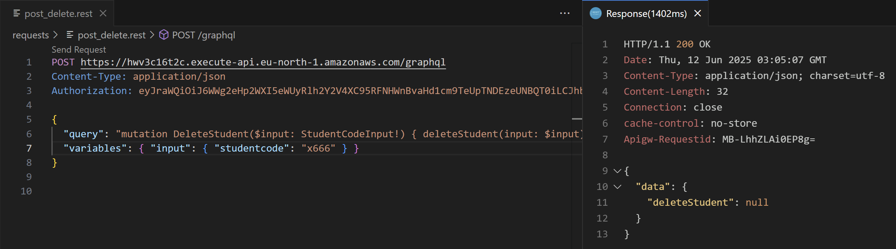
As can be seen student with studencode x666 cannot be find anymore, so deleting was succesfull.
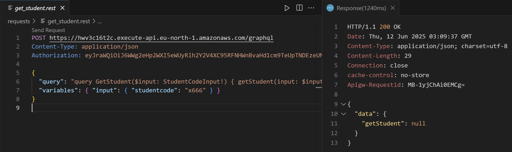


## update stydypoints

### code
```
student/
   └── updatestudypoints.js
```

### testing
```
requests/
    └── post_updatestudypoints.rest    
```

```
POST https://hwv3c16t2c.execute-api.eu-north-1.amazonaws.com/graphql
Content-Type: application/json
Authorization: eyJraWQiOiJ6WWg2eHp2WXI5eWUyRlh2Y2V4XC95RFNHWnBvaHd1cm9TeUpTNDEzeUNBQT0iLCJhbGciOiJSUzI1NiJ9.eyJzdWIiOiJkMDFjZTkzYy00MGMxLTcwNjUtNjEzMy0yNWZkYzVkYzA2OGMiLCJlbWFpbF92ZXJpZmllZCI6dHJ1ZSwiaXNzIjoiaHR0cHM6XC9cL2NvZ25pdG8taWRwLmV1LW5vcnRoLTEuYW1hem9uYXdzLmNvbVwvZXUtbm9ydGgtMV8yV0xhaXJ3bzAiLCJjb2duaXRvOnVzZXJuYW1lIjoiQUE0NTk4QHN0dWRlbnQuamFtay5maSIsIm9yaWdpbl9qdGkiOiJhNjRhZjBhNi01MzQxLTQ1ZDgtODYyNi05NmMxOTM4MWI4NTQiLCJhdWQiOiI0MzgwYWtocXMzajE0YjR2MnBtaTNxb2kxNCIsImV2ZW50X2lkIjoiYmRmZTFjMDMtNDNjNC00OTIxLTkzMjItZmEyNDk4YTQyMjQzIiwidG9rZW5fdXNlIjoiaWQiLCJhdXRoX3RpbWUiOjE3NDk2OTExOTMsImV4cCI6MTc0OTcwOTE5MywiaWF0IjoxNzQ5NjkxMTkzLCJqdGkiOiI2NzQzZDNmOC00NzMyLTQ2ODgtYTBmNC1hMzBiMzU2NDM2ZjQiLCJlbWFpbCI6IkFBNDU5OEBzdHVkZW50LmphbWsuZmkifQ.OHt35TmB3WqG4rMCaimwZSKDQa_kfeXKFkXo7XzKRiyloeM7Xr38xk3fYvMwUdtNKhcSPjcqjJqrLlZfyuaGbyKNizohe21rmF8QjyAtOwZobDc08N3aum8sEcfz3WpY6b60iPRJ_jKb1oCIKccS2uR0KgNcj6qqnGJpJxOvpdyoDVGwoDR3kfhCkMh6i7J0v5NyGnz9M0azK2bvccWBB5P-k_FB-z3-MjE8ThH5tqzIksR6mp7NDeP2Q_FyEa2pHpAQXo-K4JSMVSicdyyE6XAQYrPfmjrl8Sd4CIT7_1I4vZB8NX_bZB5ukmfBiTrM4_QUSkKyKmLzNdINfMtGsg

{
  "query": "mutation updateStudyPoints($input: StudentPointsInput!) { updateStudyPoints(input: $input) }",
  "variables": {
    "input": {
      "studentcode": "x666",
      "sp": 25
    }
  }
}
```

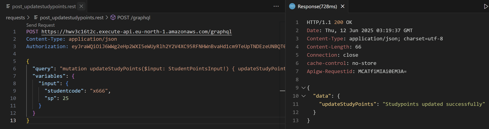
Studypoints are now updated to 25.
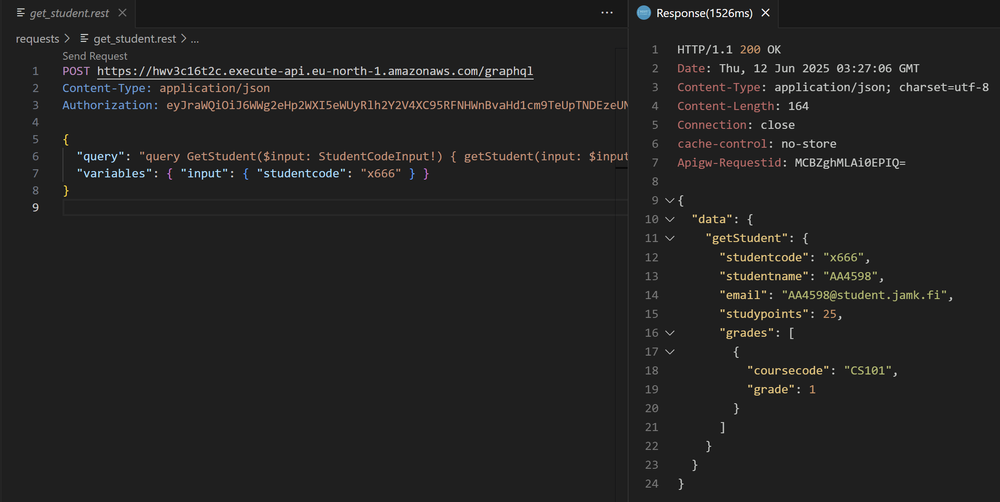
