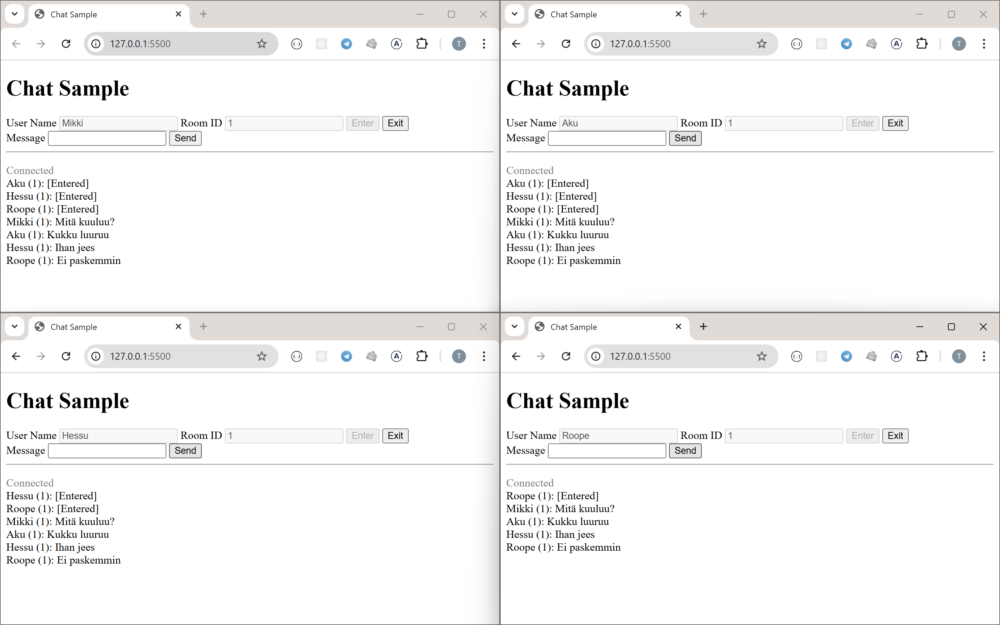
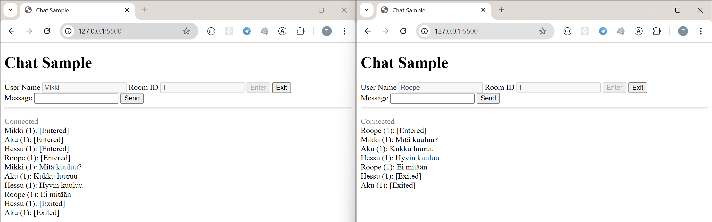
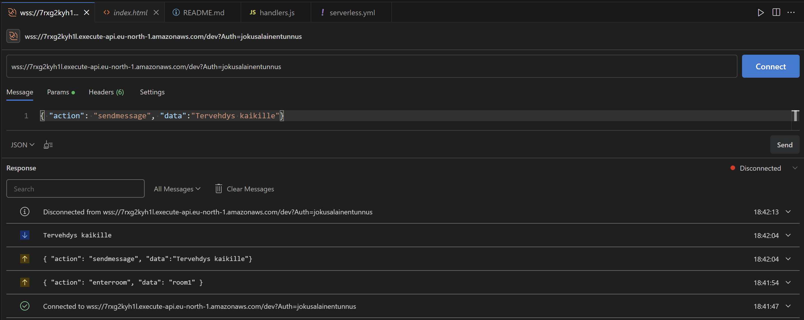

## Chat Application


Mikki, Aku, Hessu and Roopea have entered to chatroom 1 and have a little conversation each other, all the messages sent are delivered for all in the chatroom 1.


Now Hessu and Aku have exited from the chatroom. Mikki and Roope have got a message from this.


```
endpoint: 
  wss://7rxg2kyh1l.execute-api.eu-north-1.amazonaws.com/dev

functions:
  connectHandler: aws-teht4-ws-apigw-dev-connectHandler
  auth: aws-teht4-ws-apigw-dev-auth
  enterroomHandler: aws-teht4-ws-apigw-dev-enterroomHandler
  exitroomHandler: aws-teht4-ws-apigw-dev-exitroomHandler
  sendmessageHandler: aws-teht4-ws-apigw-dev-sendmessageHandler
  disconnectHandler: aws-teht4-ws-apigw-dev-disconnectHandler
  defaultHandler: aws-teht4-ws-apigw-dev-defaultHandler
  broadcastHandler: aws-teht4-ws-apigw-dev-broadcastHandler
```

### Testing
```
wss://7rxg2kyh1l.execute-api.eu-north-1.amazonaws.com/dev?Auth=jokusalainentunnus
```



### code
```
/
└── handlers.js    
```

### serverless.yml 

`functions:`
```
  connectHandler:
    handler: handlers.connectHandler
    events:
      - websocket:
          route: $connect
          authorizer:
            name: auth
            identitySource:
              - 'route.request.querystring.Auth'

  auth:
    handler: handlers.auth

  enterroomHandler:
    handler: handlers.enterroomHandler
    events:
      - websocket:
          route: enterroom

  exitroomHandler:
    handler: handlers.exitroomHandler
    events:
      - websocket:
          route: exitroom

  sendmessageHandler:
    handler: handlers.sendmessageHandler
    events:
      - websocket:
          route: sendmessage

  disconnectHandler:
    handler: handlers.disconnectHandler
    events:
      - websocket:
          route: $disconnect

  defaultHandler:
    handler: handlers.defaultHandler
    events:
      - websocket:
          route: $default

  broadcastHandler:
    handler: handlers.broadcastHandler
    events:
      - websocket:
          route: broadcast
```

